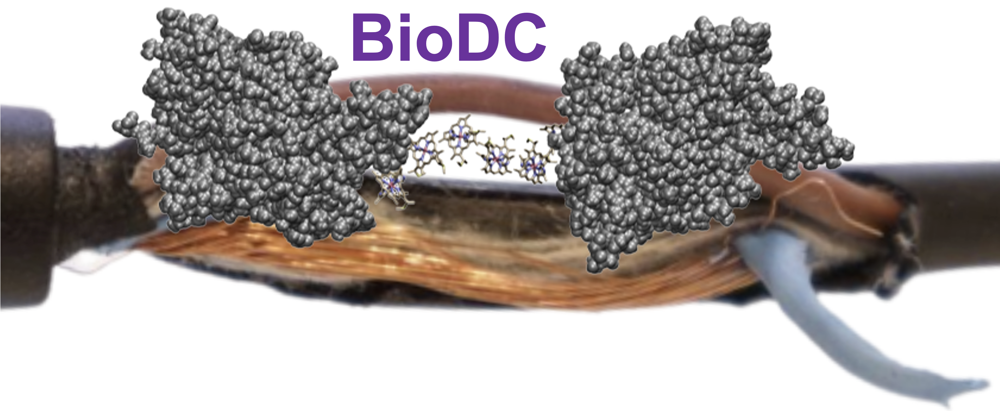

# BioDC (Version 2.0)
## A Python program that automates and accelerates the computation of redox potentials, cooperativities, and conductivities in (polymeric) multi-heme cytochromes.

### What does this project do?

BioDC has four main funcitons:

(1) Assist in the preparation of proteins containing one or more heme groups for molecular dynamics with the AMBER forcefield. The heme can be b- or c-type and be His-His or His-Met ligated. 

(2) Estimate the reaction and reorganizaiton free energies, as well as electronic couplings for heme-to-heme electron transfer. 

(3) Compute redox cooperaitivites (i.e., how much the oxidaiton of one heme influences the redox potential of another heme in the same system).

(4) Compute redox cooperativiity according to a single particle charge diffusion model or a multi-particle stead-state flux model. 

### Relevant References

The BioDC workflow and the implemented methodologies are descirbed in the following publications.

(1) Derrida, B. Velocity and diffusion constant of a periodic one-dimensional hopping model. *J. Stat. Phys.* **1983**, 31, 433-450.

(2) Guberman-Pfeffer, M. J. Assessing Thermal Response of Redox Conduction for Anti-Arrhenius Kinetics in a Microbial Cytochrome Nanowire. *J. Phys. Chem. B* **2022**, 126 (48), 10083-10097. DOI: 10.1021/acs.jpcb.2c06822  From NLM Medline.

(3) Jansson, F. Charge transport in disordered materials: simulations, theory, and numerical modeling of hopping transport and electron-hole recombination. Åbo Akademi University, 2011. https://urn.fi/URN:NBN:fi-fe201311277464.

(4) Nenashev, A.; Jansson, F.; Baranovskii, S.; Österbacka, R.; Dvurechenskii, A.; Gebhard, F. Effect of electric field on diffusion in disordered materials. I. One-dimensional hopping transport. *Physl. Rev. B* **2010**, 81 (11), 115203.

(5) Breuer, M.; Rosso, K. M.; Blumberger, J. Electron flow in multiheme bacterial cytochromes is a balancing act between heme electronic interaction and redox potentials. *Proc. Natl. Acad. Sci. U. S. A.* **2014**, 111 (2), 611-616. DOI: 10.1073/pnas.1316156111.

(6) Jiang, X.; Futera, Z.; Ali, M. E.; Gajdos, F.; von Rudorff, G. F.; Carof, A.; Breuer, M.; Blumberger, J. Cysteine Linkages Accelerate Electron Flow through Tetra-Heme Protein STC. *J. Am. Chem. Soc.* **2017**, 139 (48), 17237-17240. DOI: 10.1021/jacs.7b08831.

(7) Jiang, X.; van Wonderen, J. H.; Butt, J. N.; Edwards, M. J.; Clarke, T. A.; Blumberger, J. Which Multi-Heme Protein Complex Transfers Electrons More Efficiently? Comparing MtrCAB from Shewanella with OmcS from Geobacter. *J. Phys. Chem. Lett.* **2020**, 11 (21), 9421-9425. DOI: 10.1021/acs.jpclett.0c02842.

### Contributors
Contributions of external code to the BioDC project is most gratefully appreciated. The following researchers have contributed code so far. 
 
- Dr. Fredrik Jansson provided the Python implementation of the Derrida formula.
- Prof. Jochen Blumberger and Dr. Xiuyun Jiang providing the Python implementaiton of the steady-state flux kinetic model.

### How do I get started?

Several examples are provided. 

### Where can I get more help, if I need it?

For questions, concerns, or helpful suggestions, please contact biodchelp@gmail.com
