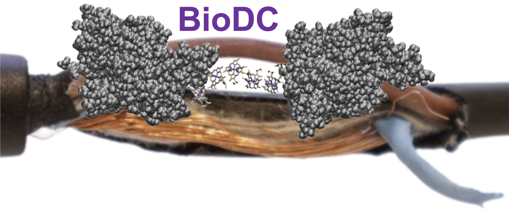

# BioDC 
## A Python program that automates and accelerates the computation of redox conductivity in polymeric multi-heme cytochromes 

### What does this project do?

BioDC computes the diffusive redox current in polymeric multi-heme cytochrome 'nanowires.' To do that, the energetics for each heme-to-heme electron transfer are estimated from the heme solvent accessibility and stacking geometry, as well as the redox-linked change in electrostatic energy. Standard Marcus-theory rates are computed and used to determine a single-particle diffusion coefficient along a one-dimensional chain of ('hopping') sites with the analytical Derrida formula. The diffusion coefficient is proportional to electrical resistance, thus allowing Ohmic redox current to be computed. 

Note that the C-program implementaiton of the Derrida formula was kindly provided by Dr. Fredrik Jansson (see Refs. 3 and 4 below). It has only been modified to interface I/O operations with the rest of the BioDC workflow. 

Relevant References: 
1) Guberman-Pfeffer, M. J. From Hot Water to Dry Dirt: Microbes Use Cytochrome ‘Nanowires’ of Similar Conductivity but Different Structure. *BioRxiv.* https://www.biorxiv.org/content/10.1101/2023.06.12.544705v1
  
2) Guberman-Pfeffer, M. J. Assessing Thermal Response of Redox Conduction for Anti-Arrhenius Kinetics in a Microbial Cytochrome Nanowire. *J. Phys. Chem.* B **2022**, 126 (48), 10083-10097.

3) Jiang, X.; van Wonderen, J. H.; Butt, J. N.; Edwards, M. J.; Clarke, T. A.; Blumberger, J. Which multi-heme protein complex transfers electrons more efficiently? Comparing MtrCAB from Shewanella with OmcS from Geobacter. *J. Phys. Chem. Lett.* **2020**, 11 (21), 9421-9425.

4) Nenashev, A. V.; Jansson, F.; Baranovskii, S. D.; Österbacka, R.; Dvurechenskii, A. V.; Gebhard, F. Effect of Electric Field on Diffusion in Disordered Materials. I. One-Dimensional Hopping Transport. *Phys. Rev.* B **2010**, 81, 115203

5) Jansson, F. Charge Transport in Disordered Materials: Simulations, Theory, and Numerical Modeling of Hopping Transport and Electron-Hole Recombination; Ph.D. Dissertation, Åbo Akademi University, Turku, Finland, **2011**.

### How do I get started?

Several examples are provided. 

### Where can I get more help, if I need it?

For questions, concerns, or helpful suggestions, please contact biodchelp@gmail.com
